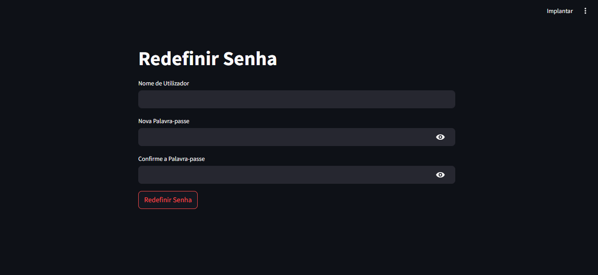

# atividade_mvp_agenda_elet
# Sistema de Agenda Eletrônica

## Descrição do Projeto
O Sistema de Agenda Eletrônica permite que os usuários agendem, editem e gerenciem seus compromissos de forma fácil e acessível. O sistema está disponível online e permite a criação de contas, recuperação de senhas e exclusão de contas.

## Funcionalidades
- **Agendamento de Compromissos**: Adicione, edite e exclua compromissos.
- **Criação de Conta**: Crie uma conta com nome de usuário e senha.
- **Recuperação de Senha**: Redefina a senha caso a esqueça.
- **Exclusão de Conta**: Exclua sua conta se não quiser mais usar o sistema.
- **Navegação**: Botão para voltar à tela inicial.

## Tecnologias Utilizadas
- **Framework**: Streamlit
- **Linguagem de Programação**: Python
- **Banco de Dados**: SQLite3

## Tipos de Testes

###1.Testes funcionais: Verificar se todas as funcionalidades do aplicativo estão funcionando corretamente, como criação, edição, exclusão e organização de notas.
###2.Testes de usabilidade: Avaliar a facilidade de uso e a intuitividade da interface do aplicativo, garantindo que o usuário tenha uma experiência agradável e eficiente.
###3.Testes de desempenho: Analisar o desempenho do aplicativo em diferentes cenários, como grande volume de notas, uso em dispositivos com diferentes configurações de hardware, etc.
###4.Testes de segurança: Garantir a proteção dos dados do usuário, implementando medidas de segurança como criptografia, autenticação e controle de acesso.
###5.Testes de compatibilidade: Verificar se o aplicativo funciona corretamente em diferentes sistemas operacionais, versões de software e dispositivos.

## Interfaces Gráficas dos Usuários
### Tela de Login
Tela de Login
Descrição: Interface para entrada de nome de usuário e senha.

### Tela de Cadastro
Tela de Cadastro
Descrição: Interface para criação de nova conta.
image

### Tela de Agendamento
Tela de Agendamento
Descrição: Interface para adicionar e gerenciar compromissos.

### Tela de Recuperação de Senha
Tela de Recuperação de Senha
Descrição: Interface para redefinir a senha.

### Tela Inicial
Tela Inicial
Descrição: Interface principal com navegação para outras funcionalidades como  hora data e outros entos.

## Tutorial de Uso
1. **Criação de Conta**: Acesse a tela de cadastro, insira seu nome de usuário e senha e clique em "Criar Conta".
2. **Login**: Acesse a tela de login, insira seu nome de usuário e senha e clique em "Entrar".
3. **Agendamento de Compromissos**: Na tela de agendamento, clique em "Adicionar Compromisso", insira os detalhes e salve.
4. **Edição de Compromissos**: Clique em um compromisso existente, edite os detalhes e salve.
5. **Exclusão de Compromissos**: Clique em um compromisso existente e selecione "Excluir".
6. **Recuperação de Senha**: Na tela de login, clique em "Esqueci minha senha", insira seu e-mail e siga as instruções para redefinir a senha.
7. **Exclusão de Conta**: Acesse as configurações da conta e selecione "Excluir Conta".

## Importância e Relevância
A agenda eletrônica é uma ferramenta essencial para a organização pessoal e profissional. Ela ajuda a evitar esquecimentos e conflitos de horários, aumentando a produtividade e eficiência. Com a possibilidade de acesso online, os usuários podem gerenciar seus compromissos de qualquer lugar, a qualquer momento.

